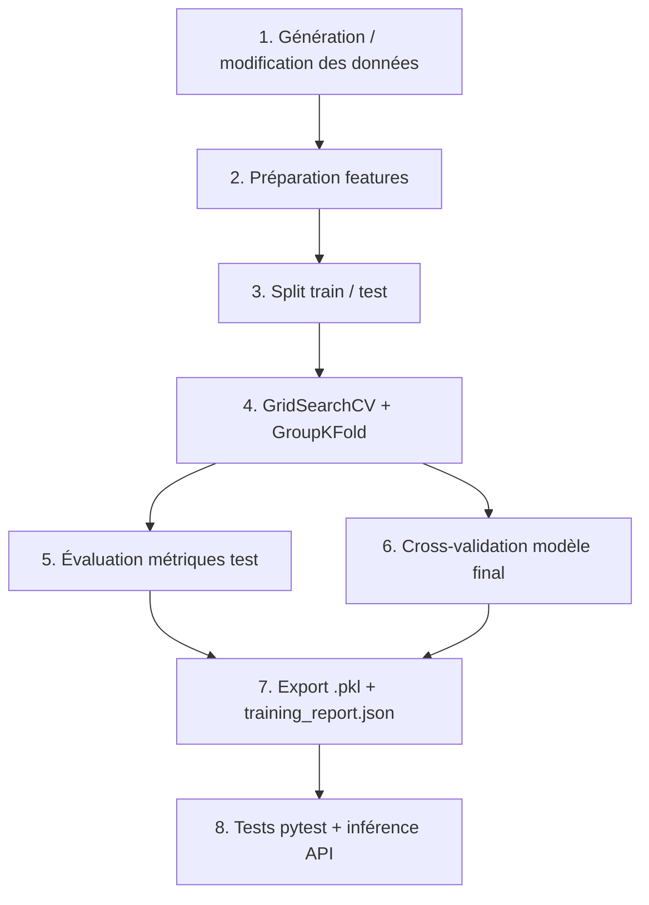
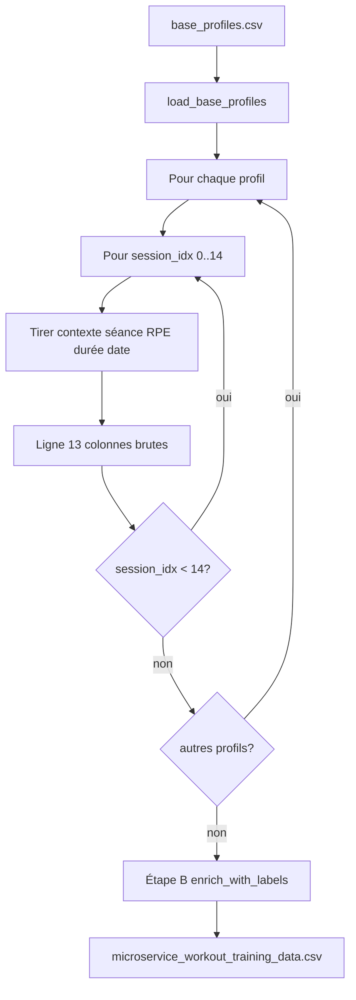
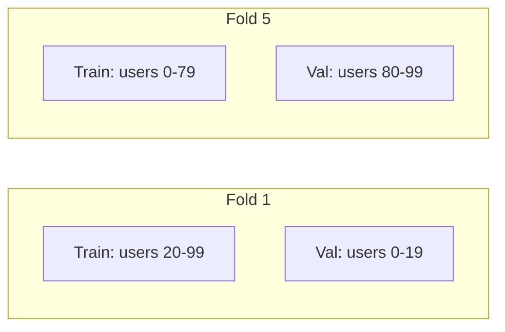

# Rapport ML — Synthèse pour documentation HealthAI Microservice IA

Document de synthèse destiné à être repris dans un rapport de projet (MSPR). Il décrit la **démarche complète** du pipeline Machine Learning et fournit un **bloc JSON** exploitable tel quel.

**Microservice** : `microservice_ia/`  
**Modèle** : Random Forest (classification activité + régression séries)  
**Version pipeline** : `2.0`  
**Fichiers sources** : `ml/generate_training_data.py`, `ml/data_prep.py`, `ml/evaluation.py`, `ml/train_random_forest.py`  
**Rapport machine** : `models/training_report.json` (`metrics.tables`, matrice de confusion)

---

## Table des matières

1. [Préparation et modification des données](#1-démarche--préparation-et-modification-des-données)
2. [Recherche et choix du modèle](#2-démarche--recherche-et-choix-du-modèle)
3. [Cross-validation](#3-démarche--cross-validation)
4. [Métriques et résultats (tableaux)](#4-démarche--métriques)
5. [Recherche des hyperparamètres](#5-démarche--recherche-des-meilleurs-hyperparamètres)
6. [Tests du modèle](#6-démarche--tests-du-modèle)
7. [Synthèse JSON](#7-synthèse-json-à-copier-dans-le-rapport)
8. [Commandes de reproduction](#8-commandes-de-reproduction)
9. [Liens internes](#9-liens-internes)

---

## Résumé exécutif — Résultats du dernier entraînement

> Détail complet en [§4](#4-démarche--métriques). Source : `models/training_report.json`.

### Classes de sortie

| Tâche | Cible | Valeurs |
|-------|-------|---------|
| Classification | `recommended_activity` | `hiit`, `musculation`, `pilates`, `running` |
| Régression | `recommended_sets` | entiers 2 à 6 |

### Performances test hold-out (300 sessions)

| Métrique | Classification | Régression |
|----------|----------------|------------|
| Principale | Accuracy **0,88** / F1 weighted **0,8801** | MAE **0,1268** / R² **0,9631** |
| Complément | F1 macro 0,9155 | RMSE 0,1999 / MAPE 4,01 % |

### Matrice de confusion (extrait)

| Réel \ Prédit | hiit | musculation | pilates | running |
|---------------|------|-------------|---------|---------|
| **hiit** | 88 | 0 | 0 | 4 |
| **musculation** | 0 | 45 | 0 | 0 |
| **pilates** | 0 | 0 | 42 | 0 |
| **running** | 32 | 0 | 0 | 89 |

### Cross-validation (5 folds, train 1200)

| Métrique | Test mean ± std | Train mean |
|----------|-----------------|------------|
| Accuracy | 0,7792 ± 0,0624 | 0,9408 |
| F1 weighted | 0,7815 ± 0,0601 | 0,9412 |
| MAE séries | 0,1425 ± 0,0187 | 0,0509 |
| R² séries | 0,9576 ± 0,0097 | 0,9942 |

---

## Vue d'ensemble du pipeline



---

## 1. Démarche — Préparation et modification des données

### Objectif

Construire un jeu d'entraînement tabulaire où chaque ligne représente **une session utilisateur**, avec des features explicatives et deux cibles :

- **`recommended_activity`** (classification) : `musculation`, `running`, `hiit`, `pilates`
- **`recommended_sets`** (régression) : nombre de séries entre 2 et 6

### Étape A — Lecture CSV de base et expansion séances (implémentation exacte)

> **Ce qui a été fait** : l’étape A lit un **CSV de profils utilisateurs** (`ml/input/base_profiles.csv`), puis **simule le contexte de chaque séance** (date, fatigue RPE, durée souhaitée). Elle est codée dans `ml/generate_training_data.py` (`load_base_profiles()` → `expand_profiles_to_sessions()`). Les labels (`recommended_activity`, `recommended_sets`, `performance_history_score`) sont calculés à l’étape B.

#### A.1 — Commande et orchestration

```bash
cd microservice_ia
# Première fois ou régénération du CSV de base (100 profils, seed 42)
python -m ml.generate_training_data --generate-base

# Exécutions suivantes (lit le CSV de base existant)
python -m ml.generate_training_data

# CSV de base personnalisé
python -m ml.generate_training_data --input chemin/vers/mes_profils.csv
```

| Élément | Détail |
|---------|--------|
| **Script** | `ml/generate_training_data.py` |
| **Entrée fichier** | `ml/input/base_profiles.csv` (1 ligne = 1 profil utilisateur) |
| **Fonction lecture** | `load_base_profiles()` → valide les 9 colonnes attendues |
| **Fonction cœur étape A** | `expand_profiles_to_sessions()` → 15 séances simulées par profil |
| **Fonction export** | `main()` → écrit le CSV d’entraînement dans `ml/data/` |
| **Sortie fichier** | `ml/data/microservice_workout_training_data.csv` (1500 lignes après A+B) |

#### A.2 — Données d’entrée (CSV de base)

**Fichier** : `ml/input/base_profiles.csv` — versionné dans le dépôt (exception `.gitignore`).

**Schéma** : 9 colonnes, **100 lignes** par défaut (`USER_000` … `USER_099`).

| Colonne | Type | Valeurs / contraintes | Rôle |
|---------|------|----------------------|------|
| `user_id` | texte | `USER_XXX` unique | Identifiant stable pour GroupKFold |
| `age` | entier | 18–59 | Profil démographique |
| `height_cm` | entier | 155–194 | Taille (cm) |
| `weight_kg` | entier | 55–109 | Poids (kg) |
| `fitness_level` | catégoriel | `debutant`, `intermediaire`, `avance` | Niveau sportif |
| `health_goal` | catégoriel | `perte_graisse`, `renforcement_musculaire`, `endurance`, `sante_generale` | Objectif santé |
| `equipment_available` | catégoriel | `poids_du_corps`, `domicile_equipé`, `salle_de_sport` | Matériel disponible |
| `preferred_activity` | catégoriel | `musculation`, `running`, `hiit`, `pilates` | Préférence utilisateur |
| `physical_limitation` | catégoriel | `aucune`, `genou`, `epaule`, `bas_dos` | Blessure / limitation |

**Génération initiale du CSV de base** (`--generate-base`) : tirages aléatoires reproductibles (`np.random.seed(42)`) via `generate_base_profiles()`. Ensuite, le fichier peut être **édité manuellement** (ajout/suppression de lignes, modification de profils) avant relance du pipeline.

**Exemple de lignes d’entrée** :

```csv
user_id,age,height_cm,weight_kg,fitness_level,health_goal,equipment_available,preferred_activity,physical_limitation
USER_000,34,178,72,intermediaire,perte_graisse,domicile_equipé,hiit,aucune
USER_001,22,165,58,debutant,sante_generale,poids_du_corps,pilates,genou
```

#### A.3 — Paramètres de simulation (contexte séance)

| Paramètre | Valeur | Effet |
|-----------|--------|-------|
| `SESSIONS_PER_USER` | `15` | 15 séances chronologiques par profil lu dans le CSV |
| **Lignes totales** | **profils × 15** | 100 × 15 = **1500** avec le CSV par défaut |
| `np.random.seed(42)` | fixe en tête de script | Même expansion séance à séance à chaque exécution |
| `start_date` | `2026-01-01` | Ancrage temporel des séances |

**Tirages aléatoires par séance** (étape A uniquement) :

| Variable | Loi / paramètres | Colonne CSV sortie |
|----------|------------------|-------------------|
| `session_date` | `2026-01-01 + session_idx × U(2,3)` jours | `session_date`, `session_timestamp` |
| `fatigue_rpe` | entier `1–10` | `current_fatigue_rpe` |
| `duration_desired` | `choice([30,45,60,90], p=[0.2,0.4,0.3,0.1])` | `desired_duration_min` |

Les **9 colonnes profil** du CSV de base sont **recopiées telles quelles** sur chaque ligne de séance.

#### A.4 — Algorithme exécuté (double boucle)



**Boucle profil** — champs **lus depuis le CSV de base** (fixes sur 15 sessions) :

| Colonne CSV base | Colonne dataset | Fixe sur 15 sessions ? |
|------------------|-----------------|------------------------|
| `user_id` | `user_id` | Oui |
| `age` | `age` | Oui |
| `height_cm` | `height_cm` | Oui |
| `weight_kg` | `weight_kg` | Oui |
| `fitness_level` | `fitness_level` | Oui |
| `health_goal` | `health_goal` | Oui |
| `equipment_available` | `equipment_available` | Oui |
| `preferred_activity` | `preferred_activity` | Oui |
| `physical_limitation` | `physical_limitation` | Oui |

**Boucle session** — champs **simulés** à chaque séance :

| Champ simulé | Colonne CSV |
|--------------|-------------|
| `session_date` | `session_date` (YYYY-MM-DD) |
| `session_date.timestamp()` | `session_timestamp` (Unix) |
| `fatigue_rpe` | `current_fatigue_rpe` |
| `duration_desired` | `desired_duration_min` |

#### A.5 — Données de sortie de l’étape A (brutes, avant règles métier)

Après expansion, **par ligne**, on dispose de **13 colonnes observées** :

| Colonne | Source | Exemple |
|---------|--------|---------|
| `user_id` | CSV base | `USER_017` |
| `session_date` | simulation | `2026-01-07` |
| `session_timestamp` | conversion date | `1767753600` |
| `age` … `physical_limitation` | CSV base | profil recopié |
| `current_fatigue_rpe` | simulation | `6` |
| `desired_duration_min` | simulation | `45` |

**Pas encore produites à l’étape A** (étape B) : `performance_history_score`, `recommended_activity`, `recommended_sets`.

#### A.6 — Export fichier (fin pipeline A+B)

| Attribut | Valeur |
|----------|--------|
| **Entrée** | `ml/input/base_profiles.csv` |
| **Sortie** | `ml/data/microservice_workout_training_data.csv` |
| **Format sortie** | CSV UTF-8, séparateur `,`, en-tête ligne 1 |
| **Dimensions finales** (après A+B) | 1500 lignes × 17 colonnes |
| **Git** | CSV de base versionné ; CSV d’entraînement dans `ml/data/` (gitignored) |

Commande `main()` :

```python
base_df = load_base_profiles(INPUT_BASE_CSV)      # étape A — lecture
sessions_df = expand_profiles_to_sessions(base_df) # étape A — expansion
df = enrich_with_labels(sessions_df)               # étape B — labels
df.to_csv(OUTPUT_CSV, index=False)
```

#### A.7 — Pourquoi l’étape A existe

| Raison | Détail |
|--------|--------|
| **Séparation profil / séance** | Le CSV de base modélise des utilisateurs réels ou simulés ; l’expansion ajoute l’historique session-level |
| **CSV éditable** | On peut enrichir ou remplacer `base_profiles.csv` sans toucher au code |
| **Population contrôlée** | 100 users × 15 sessions = volume suffisant pour GridSearch + CV |
| **Reproductibilité** | Seed fixe + profils versionnés → résultats reproductibles |
| **Alignement features API** | Colonnes calquées sur `UserProfile` + `ExerciseRecommendationContext` |

#### A.8 — Lien avec l’étape B

| Étape A (CSV → sessions) | Étape B (règles métier) |
|--------------------------|-------------------------|
| Lecture `base_profiles.csv` | Calcul `performance_history_score` |
| Expansion contexte séance | Calcul `recommended_activity` |
| 13 colonnes « observées » | Calcul `recommended_sets` |
| | + 2 labels + 1 feature dérivée → **17 colonnes** |

Les deux étapes s’enchaînent dans `generate_dataset()` ; la séparation est pédagogique pour le rapport.

### Étape B — Construction et enrichissement des données (implémentation exacte)

> **Ce qui a été fait dans le projet** : il n’y a pas eu de modification manuelle du CSV. L’étape B est entièrement codée dans `ml/generate_training_data.py` via la fonction `generate_dataset()`. Elle transforme des **paramètres de simulation + tirages aléatoires + règles métier** en **1500 lignes labellisées** prêtes pour l’entraînement.

#### B.1 — Données d’entrée (ce qui alimente la génération)

L’étape B reçoit le **DataFrame session-level** produit par l’étape A (13 colonnes brutes). En amont, l’étape A lit `ml/input/base_profiles.csv`.

| Entrée | Type | Source | Rôle |
|--------|------|--------|------|
| Profils utilisateurs | CSV | `ml/input/base_profiles.csv` | 9 colonnes profil par `user_id` |
| Contexte séance | simulation | `expand_profiles_to_sessions()` | date, RPE, durée par séance |
| `SESSIONS_PER_USER` | constante | `15` | Sessions chronologiques par profil |
| `np.random.seed(42)` | constante | fixe | Reproductibilité des tirages séance |
| `start_date` | datetime | `2026-01-01` | Origine temporelle des sessions |

**Par utilisateur** (tiré une fois, puis **figé** pour ses 15 sessions) :

| Variable interne | Plage / loi | Pourquoi |
|------------------|-------------|----------|
| `age` | 18–59 | Profil biométrique |
| `height` | 155–194 cm | Profil biométrique |
| `weight` | 55–109 kg | Profil biométrique |
| `fitness_level` | voir LEVELS | Niveau d’entraînement global |
| `health_goal` | voir GOALS | Objectif principal |
| `equipment` | voir EQUIPMENTS | Contrainte matérielle |
| `preferred_act` | voir ACTIVITIES | Préférence declarée |
| `injury` | voir INJURIES | Blessure / limitation |
| `base_performance_modifier` | 1.0 / 1.3 / 1.6 | Selon niveau (débutant / inter / avancé) — base du score d’historique |

**Par session** (tiré à chaque `session_idx` de 0 à 14) :

| Variable interne | Plage / loi | Pourquoi |
|------------------|-------------|----------|
| `session_date` | +2 à +3 jours × index | Simule une séance tous les 2–3 jours |
| `fatigue_rpe` | 1–10 | Fatigue du jour (feature dynamique) |
| `duration_desired` | 30/45/60/90 min (20/40/30/10 %) | Temps disponible souhaité |

#### B.2 — Transformations appliquées (enrichissement)

Deux **features dérivées** et deux **labels** sont calculés par règles métier :

**1. `performance_history_score`** (feature enrichie)

```text
score = (base_performance_modifier × 10) + (session_idx × 0.3) − (fatigue_rpe × 0.2)
score = max(5.0, arrondi 2 décimales)
```

| Effet | Pourquoi |
|-------|----------|
| Niveau débutant → score plus bas | Moins de capacité initiale |
| `session_idx` croissant → score monte | Progression dans le temps |
| `fatigue_rpe` haute → score baisse | Journée difficile = perf historique plus faible |

**2. `recommended_activity`** (label classification)

| Condition (priorité haute → basse) | Activité assignée | Pourquoi |
|-----------------------------------|-------------------|----------|
| `injury == genou` + objectif `sante_generale` | `pilates` | Éviter impact genou |
| `injury == genou` + autre objectif | `musculation` | Alternative bas impact |
| `injury == epaule` + objectif `renforcement_musculaire` | `musculation` | Focus bas du corps possible |
| `health_goal == perte_graisse` | `hiit` 60 % ou `running` 40 % | Cardio / HIIT pour déficit |
| `health_goal == endurance` | `running` | Aligné objectif |
| Sinon | `preferred_act` | Respect préférence si pas de contre-indication |

**3. `recommended_sets`** (label régression)

```text
base_sets = 3 (débutant) | 4 (intermédiaire) | 5 (avancé)
si session_idx > 10  → base_sets + 1    # surcharge progressive
si fatigue_rpe >= 8  → base_sets − 2    # fatigue forte
si fatigue_rpe >= 5  → base_sets − 1    # fatigue modérée
recommended_sets = clip(base_sets, 2, 6)
```

| Effet | Pourquoi |
|-------|----------|
| Niveau plus élevé → plus de séries | Volume adapté à l’expérience |
| Sessions tardives → +1 série | Surcharge progressive |
| Fatigue → moins de séries | Même logique que l’API `/adjust` du microservice |

#### B.3 — Données de sortie (une ligne = une session)

**Fichier produit** : `ml/data/microservice_workout_training_data.csv`  
**Volume** : 100 × 15 = **1500 lignes**, **17 colonnes**

| Colonne | Rôle dans le ML | Entrée modèle (X) | Cible (y) |
|---------|-----------------|-------------------|-----------|
| `user_id` | Groupe CV (`GroupKFold`) | Non | Non |
| `session_date` | Traçabilité | Non | Non |
| `session_timestamp` | Feature temporelle | **Oui** | Non |
| `age` | Profil | **Oui** | Non |
| `height_cm` | Profil | **Oui** | Non |
| `weight_kg` | Profil | **Oui** | Non |
| `fitness_level` | Profil (catégoriel) | **Oui** (encodé) | Non |
| `health_goal` | Objectif (catégoriel) | **Oui** (encodé) | Non |
| `equipment_available` | Matériel (catégoriel) | **Oui** (encodé) | Non |
| `preferred_activity` | Préférence (catégoriel) | **Oui** (encodé) | Non |
| `physical_limitation` | Blessure (catégoriel) | **Oui** (encodé) | Non |
| `current_fatigue_rpe` | Contexte séance | **Oui** | Non |
| `desired_duration_min` | Contexte séance | **Oui** | Non |
| `performance_history_score` | Feature dérivée | **Oui** | Non |
| `recommended_activity` | — | Non | **Oui (classifier)** |
| `recommended_sets` | — | Non | **Oui (regressor)** |

**12 features** → matrice **X** (7 numériques + 5 catégorielles encodées à l’étape C).  
**2 cibles** → **y_class** et **y_reg**.

#### B.4 — Pourquoi cette étape existe

| Objectif | Explication |
|----------|-------------|
| **Alignement microservice** | Les labels reproduisent la logique rule-based du service (blessures, objectifs, fatigue) pour que le RF apprenne les mêmes arbitrages |
| **Features dynamiques vs statiques** | Profil user stable + contexte séance variable → même schéma que l’API (`generate` + feedback + historique) |
| **Deux tâches distinctes** | Activité (classification) et volume (régression) = deux modèles comme en inférence |
| **Groupes par `user_id`** | Sessions corrélées d’un même user → nécessaire pour une CV réaliste |
| **Reproductibilité** | Seed 42 + CSV versionné → entraînements comparables entre runs |

#### B.5 — Comment modifier les données ensuite (options)

| Action | Entrée | Sortie | Quand l’utiliser |
|--------|--------|--------|------------------|
| Éditer `ml/input/base_profiles.csv` | CSV profils | Nouveau dataset | Modifier/ajouter des utilisateurs sans toucher au code |
| Changer règles dans `apply_label_rules()` | Code Python | Nouveau CSV | Ajuster logique métier des labels |
| Régénérer profils synthétiques | `--generate-base` | `base_profiles.csv` + dataset | Repartir de 100 profils aléatoires (seed 42) |
| Exporter `session_logs` MongoDB (futur) | Logs production | `base_profiles.csv` ou CSV session | Ré-entraînement sur données réelles |

Après toute modification : `python -m ml.train_random_forest` recharge le CSV et ré-entraîne.

### Étape C — Encodage (`ml/data_prep.py`)

| Type | Colonnes |
|------|----------|
| Numériques | `session_timestamp`, `age`, `height_cm`, `weight_kg`, `current_fatigue_rpe`, `desired_duration_min`, `performance_history_score` |
| Catégorielles (LabelEncoder) | `fitness_level`, `health_goal`, `equipment_available`, `preferred_activity`, `physical_limitation` |
| Cible classification | `recommended_activity` |
| Cible régression | `recommended_sets` |
| **Groupe CV** | `user_id` (empêche de mélanger les sessions d'un même user entre train et validation) |

---

## 2. Démarche — Recherche et choix du modèle

### Modèles retenus

Deux **Random Forest** scikit-learn indépendants :

| Modèle | Classe sklearn | Tâche | Sortie |
|--------|----------------|-------|--------|
| Classifier | `RandomForestClassifier` | Prédire l'activité recommandée | 1 parmi 4 activités |
| Regressor | `RandomForestRegressor` | Prédire le volume (séries) | Entier 2–6 |

### Classes de sortie (cibles du modèle)

| Tâche | Colonne cible | Type | Classes / plage |
|-------|---------------|------|-----------------|
| Classification | `recommended_activity` | multiclasse | `hiit`, `musculation`, `pilates`, `running` |
| Régression | `recommended_sets` | entier | 2 à 6 séries |

Encodage LabelEncoder (ordre) : `hiit`=0, `musculation`=1, `pilates`=2, `running`=3.

### Justification

- Données tabulaires mixtes (numériques + catégories encodées)
- Règles métier non linéaires dans les labels synthétiques
- Interprétabilité des features, robustesse, peu de preprocessing
- Cohérent avec la spec initiale du projet (Random Forest)

### Pipeline de recherche

1. Split **80 % train / 20 % test** (stratifié sur l'activité).
2. **GridSearchCV** sur le jeu train pour chaque modèle (voir §5).
3. Réentraînement implicite du meilleur estimateur (`refit=True`).
4. Évaluation sur le **jeu test hold-out** (jamais vu pendant la recherche).
5. Cross-validation du modèle final sur le train (voir §3 et §4).
6. Export `models/workout_rf_bundle.pkl` + `models/training_report.json`.

---

## 3. Démarche — Cross-validation

### Stratégie : GroupKFold par `user_id`

**Pourquoi** : un utilisateur a 15 sessions corrélées. Un KFold classique mettrait des sessions du même user en train et en validation → **sur-estimation** des performances.



| Paramètre | Valeur |
|-----------|--------|
| Méthode | `GroupKFold` |
| Folds | 5 (configurable via `ML_CV_FOLDS`) |
| Groupe | `user_id` |
| Utilisation 1 | **GridSearchCV** (sélection hyperparamètres) |
| Utilisation 2 | **cross_validate** sur modèle final (rapport de généralisation) |

### Métriques agrégées par fold

Pour chaque métrique : `test_mean`, `test_std`, `train_mean`, `fold_test_scores[]`.

### Résultats CV du dernier entraînement

#### Classification

| Métrique | Test mean | Test std | Train mean | Scores par fold (test) |
|----------|-----------|----------|------------|------------------------|
| Accuracy | 0,7792 | 0,0624 | 0,9408 | 0,8375 · 0,6917 · 0,8375 · 0,8125 · 0,7167 |
| F1 weighted | 0,7815 | 0,0601 | 0,9412 | 0,8344 · 0,6917 · 0,8385 · 0,8147 · 0,7282 |
| Precision weighted | 0,8000 | 0,0593 | 0,9484 | 0,8523 · 0,6931 · 0,8413 · 0,8351 · 0,7781 |
| Recall weighted | 0,7792 | 0,0624 | 0,9408 | 0,8375 · 0,6917 · 0,8375 · 0,8125 · 0,7167 |

#### Régression (séries)

| Métrique | Test mean | Test std | Train mean | Scores par fold (test) |
|----------|-----------|----------|------------|------------------------|
| MAE | 0,1425 | 0,0187 | 0,0509 | 0,1244 · 0,1351 · 0,1369 · 0,1786 · 0,1373 |
| RMSE | 0,2046 | 0,0299 | 0,0771 | 0,1767 · 0,1867 · 0,1985 · 0,2620 · 0,1990 |
| R² | 0,9576 | 0,0097 | 0,9942 | 0,9662 · 0,9649 · 0,9638 · 0,9408 · 0,9525 |

---

## 4. Démarche — Métriques

**Implémentation** : `ml/evaluation.py` — calcul des métriques, matrice de confusion labellisée, tableaux synthétiques exportés dans `models/training_report.json` (`metrics.tables`).

### Classes de sortie du modèle

| Tâche | Cible | Type | Valeurs possibles |
|-------|-------|------|-------------------|
| **Classification** | `recommended_activity` | multiclasse | `hiit`, `musculation`, `pilates`, `running` |
| **Régression** | `recommended_sets` | entier | 2 à 6 séries |

Ordre des classes en classification (LabelEncoder) : `hiit` → 0, `musculation` → 1, `pilates` → 2, `running` → 3.

### Métriques calculées

#### Classification (activité)

| Métrique | Rôle |
|----------|------|
| **Accuracy** | Part de bonnes prédictions |
| **Precision / Recall weighted** | Performance globale pondérée par le support de classe |
| **F1 weighted / macro** | Équilibre precision-recall (F1 weighted = critère de GridSearch) |
| **Métriques par classe** | Precision, recall, F1 et support pour chaque activité |
| **Matrice de confusion** | Lignes = classe réelle, colonnes = classe prédite |

#### Régression (séries)

| Métrique | Rôle |
|----------|------|
| **MAE** | Erreur absolue moyenne (critère GridSearch regressor) |
| **RMSE** | Pénalise les grosses erreurs |
| **R²** | Variance expliquée |
| **MAPE** | Erreur en pourcentage |

### Jeux évalués

1. **Test hold-out (20 %)** — estimation finale sur 300 sessions jamais vues.
2. **Cross-validation (train 80 %)** — stabilité sur 5 folds GroupKFold ; comparer `train_mean` vs `test_mean` pour détecter le sur-apprentissage.

---

### Résultats du dernier entraînement (tableaux)

> Source : `models/training_report.json` — jeu 1200 train / 300 test, 5 folds CV.

#### Jeu de données

| Élément | Valeur |
|---------|--------|
| Échantillons train | 1200 |
| Échantillons test | 300 |
| Folds CV | 5 |

#### Test hold-out — classification (global)

| Métrique | Valeur |
|----------|--------|
| Accuracy | 0,8800 |
| Precision (weighted) | 0,9009 |
| Recall (weighted) | 0,8800 |
| F1 (weighted) | 0,8801 |
| F1 (macro) | 0,9155 |

#### Test hold-out — classification (par classe)

| Classe | Precision | Recall | F1 | Support |
|--------|-----------|--------|-----|---------|
| hiit | 0,7333 | 0,9565 | 0,8302 | 92 |
| musculation | 1,0000 | 1,0000 | 1,0000 | 45 |
| pilates | 1,0000 | 1,0000 | 1,0000 | 42 |
| running | 0,9570 | 0,7355 | 0,8318 | 121 |

#### Matrice de confusion (test hold-out)

Lignes = **classe réelle**, colonnes = **classe prédite**.

| Réel \ Prédit | hiit | musculation | pilates | running |
|---------------|------|-------------|---------|---------|
| **hiit** | 88 | 0 | 0 | 4 |
| **musculation** | 0 | 45 | 0 | 0 |
| **pilates** | 0 | 0 | 42 | 0 |
| **running** | 32 | 0 | 0 | 89 |

**Lecture** : 32 sessions `running` ont été prédites à tort comme `hiit` ; 4 sessions `hiit` prédites `running`.

#### Test hold-out — régression (séries)

| Métrique | Valeur |
|----------|--------|
| MAE | 0,1268 |
| RMSE | 0,1999 |
| R² | 0,9631 |
| MAPE (%) | 4,01 |

#### Cross-validation — classification (moyenne ± écart-type)

| Métrique | Test mean | Test std | Train mean |
|----------|-----------|----------|------------|
| Accuracy | 0,7792 | 0,0624 | 0,9408 |
| F1 weighted | 0,7815 | 0,0601 | 0,9412 |
| Precision weighted | 0,8000 | 0,0593 | 0,9484 |
| Recall weighted | 0,7792 | 0,0624 | 0,9408 |

Scores par fold (test) — accuracy : `[0,8375, 0,6917, 0,8375, 0,8125, 0,7167]`

#### Cross-validation — régression (moyenne ± écart-type)

| Métrique | Test mean | Test std | Train mean |
|----------|-----------|----------|------------|
| MAE | 0,1425 | 0,0187 | 0,0509 |
| RMSE | 0,2046 | 0,0299 | 0,0771 |
| R² | 0,9576 | 0,0097 | 0,9942 |

**Interprétation sur-apprentissage** : écart train/test en CV (ex. accuracy 0,94 vs 0,78) indique un léger sur-apprentissage, attendu sur données synthétiques avec règles métier partiellement apprises.

---

## 5. Démarche — Recherche des meilleurs hyperparamètres

### Méthode : GridSearchCV

Recherche **exhaustive** sur une grille prédéfinie, évaluée par cross-validation groupée.

### Grille explorée (mode complet)

| Hyperparamètre | Classifier | Regressor |
|----------------|------------|-----------|
| `n_estimators` | 80, 120, 160 | 80, 120, 160 |
| `max_depth` | 8, 12, 16, None | 6, 10, 14, None |
| `min_samples_split` | 2, 5 | 2, 5 |
| `min_samples_leaf` | 1, 2 | 1, 2 |
| `max_features` | sqrt, log2 | sqrt, log2 |

**Mode rapide** (`ML_FAST_TRAIN=1`) : grille réduite pour tests/CI.

### Critères de sélection

| Modèle | Scoring GridSearch | Interprétation |
|--------|-------------------|----------------|
| Classifier | `f1_weighted` | Maximiser F1 pondéré |
| Regressor | `neg_mean_absolute_error` | Minimiser MAE |

### Livrables hyperparamètres

- `best_params` dans le bundle `.pkl`
- `hyperparameter_search` dans `training_report.json` (best_score CV, cv_results)

### Meilleurs hyperparamètres — dernier run

| Modèle | Paramètre | Valeur retenue |
|--------|-----------|----------------|
| **Classifier** | `n_estimators` | 120 |
| | `max_depth` | 8 |
| | `max_features` | sqrt |
| | `min_samples_split` | 2 |
| | `min_samples_leaf` | 2 |
| | **Score CV GridSearch** | F1 weighted = **0,7815** |
| **Regressor** | `n_estimators` | 160 |
| | `max_depth` | 14 |
| | `max_features` | sqrt |
| | `min_samples_split` | 2 |
| | `min_samples_leaf` | 1 |
| | **Score CV GridSearch** | MAE = **0,1425** (neg_MAE = −0,1425) |

---

## 6. Démarche — Tests du modèle

### A. Tests automatisés (pytest)

| Fichier | Tests | Objectif |
|---------|-------|----------|
| `tests/test_ml_training.py` | 5 | Préparation data, métriques, CV, export rapport |
| `tests/test_ml.py` | 2 | Chargement `.pkl`, inférence, API generate avec ML |
| `tests/test_api.py` | 11 | API v1 complète (generate, adjust, feedback, progression) |
| `tests/test_calorie_use_case.py` | 2 | Mifflin (hors ML mais même microservice) |
| `tests/test_exercise_use_case.py` | 2 | Rule-based fallback |

**Commande** : `pytest -v` (22 tests)

### B. Test manuel bout-en-bout

**Script** : `python scripts/test_program_flow.py`  
Enregistre requêtes/réponses dans `scripts/test_program_flow_result_*.json`.

### C. Validation en conditions réelles

1. Entraîner : `python -m ml.train_random_forest`
2. Vérifier : `GET /health` → `"ml_engine": "loaded"`
3. Appeler : `POST /api/v1/recommendations/generate`
4. Contrôler : activité, séries, justification `"Random Forest …"` dans les exercices

---

## 7. Synthèse JSON (à copier dans le rapport)

Le JSON ci-dessous résume **l'intégralité de la démarche** et inclut les **résultats du dernier entraînement** (`models/training_report.json`).

> Fichier JSON autonome également disponible : [`synthese_ml_rapport.json`](synthese_ml_rapport.json)

```json
{
  "meta": {
    "projet": "HealthAI MSPR — microservice_ia",
    "pipeline_version": "2.0",
    "modele": "Random Forest (Classifier + Regressor)",
    "objectif": "Recommander une activité physique et un volume de séries personnalisés",
    "fichier_modele": "models/workout_rf_bundle.pkl",
    "fichier_rapport_detaille": "models/training_report.json",
    "date_reference_entrainement": "2026-06-19"
  },
  "demarche_preparation_donnees": {
    "objectif": "Produire un dataset tabulaire session-level avec features profil/contexte et labels activité + séries",
    "etapes": [
      {
        "ordre": 1,
        "nom": "Lecture CSV base et expansion séances",
        "script": "python -m ml.generate_training_data",
        "entree": "ml/input/base_profiles.csv",
        "sortie": "ml/data/microservice_workout_training_data.csv",
        "volume": { "utilisateurs": 100, "sessions_par_utilisateur": 15, "lignes_totales": 1500 },
        "colonnes_entree": [
          "user_id", "age", "height_cm", "weight_kg",
          "fitness_level", "health_goal", "equipment_available",
          "preferred_activity", "physical_limitation"
        ],
        "reproductibilite": "np.random.seed(42) + CSV base versionné",
        "commande_initiale": "python -m ml.generate_training_data --generate-base"
      },
      {
        "ordre": 2,
        "nom": "Modification des données",
        "options": [
          "Éditer ml/input/base_profiles.csv (profils utilisateurs)",
          "Ajuster les règles métier dans generate_training_data.py (apply_label_rules)",
          "Futur : exporter session_logs MongoDB vers base_profiles.csv"
        ]
      },
      {
        "ordre": 3,
        "nom": "Encodage et matrices",
        "script": "ml/data_prep.py",
        "features_numeriques": [
          "session_timestamp", "age", "height_cm", "weight_kg",
          "current_fatigue_rpe", "desired_duration_min", "performance_history_score"
        ],
        "features_categorielles_encodees": [
          "fitness_level", "health_goal", "equipment_available",
          "preferred_activity", "physical_limitation"
        ],
        "cibles": {
          "classification": "recommended_activity",
          "regression": "recommended_sets"
        },
        "groupe_cross_validation": "user_id"
      }
    ],
    "regles_metier_labels": [
      "Blessure genou → pilates ou musculation (éviter impact)",
      "Objectif perte_graisse → hiit ou running",
      "Objectif endurance → running",
      "Fatigue RPE élevée → réduction du nombre de séries",
      "Progression session_idx → légère surcharge de séries"
    ]
  },
  "demarche_recherche_modele": {
    "modeles_candidats": [
      {
        "nom": "RandomForestClassifier",
        "tache": "Classification multi-classe activité",
        "classes": ["musculation", "running", "hiit", "pilates"]
      },
      {
        "nom": "RandomForestRegressor",
        "tache": "Régression volume séries",
        "plage_attendue": "2-6 séries"
      }
    ],
    "justification": "Données tabulaires, règles non linéaires, robustesse, alignement spec projet",
    "protocol": [
      "Split train/test 80-20 stratifié sur recommended_activity",
      "GridSearchCV sur train avec GroupKFold(user_id)",
      "Sélection best_params par scoring dédié (f1_weighted / MAE)",
      "Évaluation finale sur test hold-out 20%",
      "Cross-validation du modèle retenu sur train",
      "Export joblib bundle v2.0 pour inférence FastAPI"
    ],
    "split": {
      "methode": "train_test_split",
      "test_size": 0.2,
      "random_state": 42,
      "stratify": "recommended_activity"
    }
  },
  "demarche_cross_validation": {
    "methode": "GroupKFold",
    "folds": 5,
    "variable_groupe": "user_id",
    "raison": "Éviter la fuite de sessions corrélées d'un même utilisateur entre train et validation",
    "usages": [
      "Validation interne GridSearchCV (sélection hyperparamètres)",
      "Évaluation post-sélection via cross_validate (stabilité du modèle final)"
    ],
    "agregats_par_metrique": ["test_mean", "test_std", "train_mean", "fold_test_scores"],
    "variables_environnement": {
      "ML_CV_FOLDS": "Nombre de folds (défaut 5)"
    }
  },
  "demarche_metriques": {
    "classes_sortie": {
      "classification": { "target": "recommended_activity", "classes": ["hiit", "musculation", "pilates", "running"], "type": "multiclass" },
      "regression": { "target": "recommended_sets", "type": "integer", "plage": [2, 6] }
    },
    "classification": {
      "metriques_globales": ["accuracy", "precision_weighted", "recall_weighted", "f1_weighted", "f1_macro"],
      "metriques_par_classe": ["precision", "recall", "f1_score", "support"],
      "artefacts": ["per_class_metrics", "confusion_matrix_table", "classification_report"],
      "critere_selection_modele": "f1_weighted"
    },
    "regression": {
      "metriques": ["mae", "rmse", "r2", "mape"],
      "critere_selection_modele": "mae (neg_mean_absolute_error en GridSearch)"
    },
    "export_tableaux": "metrics.tables dans training_report.json",
    "contextes_evaluation": {
      "test_holdout": "Jeu test 20% jamais vu pendant GridSearch",
      "cross_validation": "Jeu train 80% — moyenne et écart-type sur 5 folds"
    },
    "interpretation_surapprentissage": "Comparer train_mean vs test_mean en CV ; écart élevé → sur-apprentissage"
  },
  "demarche_recherche_hyperparametres": {
    "methode": "GridSearchCV",
    "refit": true,
    "grille_complete": {
      "n_estimators": [80, 120, 160],
      "max_depth_classifier": [8, 12, 16, null],
      "max_depth_regressor": [6, 10, 14, null],
      "min_samples_split": [2, 5],
      "min_samples_leaf": [1, 2],
      "max_features": ["sqrt", "log2"]
    },
    "grille_rapide_ML_FAST_TRAIN_1": {
      "n_estimators": [80, 120],
      "max_depth": "grille réduite",
      "usage": "Tests pytest et CI"
    },
    "scoring": {
      "classifier": "f1_weighted",
      "regressor": "neg_mean_absolute_error"
    },
    "meilleurs_hyperparametres_dernier_run": {
      "classifier": {
        "n_estimators": 120,
        "max_depth": 8,
        "max_features": "sqrt",
        "min_samples_split": 2,
        "min_samples_leaf": 2
      },
      "regressor": {
        "n_estimators": 160,
        "max_depth": 14,
        "max_features": "sqrt",
        "min_samples_split": 2,
        "min_samples_leaf": 1
      }
    },
    "scores_cv_gridsearch": {
      "classifier_best_f1_weighted": 0.7815,
      "regressor_best_neg_mae": -0.1425
    }
  },
  "demarche_tests_modele": {
    "tests_unitaires_et_integration": {
      "framework": "pytest",
      "commande": "pytest -v",
      "nombre_total": 22,
      "fichiers_ml": [
        {
          "fichier": "tests/test_ml_training.py",
          "focus": "data_prep, evaluate_classifier/regressor, cross_validate, export report"
        },
        {
          "fichier": "tests/test_ml.py",
          "focus": "Chargement pkl, prédiction adaptateur, API generate avec ML"
        }
      ]
    },
    "test_manuel": {
      "script": "scripts/test_program_flow.py",
      "sortie": "scripts/test_program_flow_result_YYYYMMDD_HHMMSS.json",
      "enchainement": ["GET /health", "POST /generate", "GET /current", "POST /adjust"]
    },
    "validation_production": {
      "health_check": "GET /health → ml_engine: loaded",
      "routes_inference": [
        "POST /recommandation_exercice",
        "POST /api/v1/recommendations/generate"
      ]
    }
  },
  "resultats_dernier_entrainement": {
    "jeu_donnees": { "train_samples": 1200, "test_samples": 300, "cv_folds": 5 },
    "classes_sortie": {
      "classification": ["hiit", "musculation", "pilates", "running"],
      "regression": { "target": "recommended_sets", "plage": [2, 6] }
    },
    "test_holdout": {
      "classification_global": [
        { "metrique": "accuracy", "valeur": 0.88 },
        { "metrique": "f1_weighted", "valeur": 0.8801 },
        { "metrique": "f1_macro", "valeur": 0.9155 },
        { "metrique": "precision_weighted", "valeur": 0.9009 },
        { "metrique": "recall_weighted", "valeur": 0.88 }
      ],
      "classification_par_classe": [
        { "class": "hiit", "precision": 0.7333, "recall": 0.9565, "f1_score": 0.8302, "support": 92 },
        { "class": "musculation", "precision": 1.0, "recall": 1.0, "f1_score": 1.0, "support": 45 },
        { "class": "pilates", "precision": 1.0, "recall": 1.0, "f1_score": 1.0, "support": 42 },
        { "class": "running", "precision": 0.957, "recall": 0.7355, "f1_score": 0.8318, "support": 121 }
      ],
      "matrice_confusion": {
        "labels": ["hiit", "musculation", "pilates", "running"],
        "matrix": [[88, 0, 0, 4], [0, 45, 0, 0], [0, 0, 42, 0], [32, 0, 0, 89]]
      },
      "regression": [
        { "metrique": "mae", "valeur": 0.1268 },
        { "metrique": "rmse", "valeur": 0.1999 },
        { "metrique": "r2", "valeur": 0.9631 },
        { "metrique": "mape", "valeur": 4.0091 }
      ]
    },
    "cross_validation": {
      "classification": [
        { "metrique": "accuracy", "test_mean": 0.7792, "test_std": 0.0624, "train_mean": 0.9408, "fold_test_scores": [0.8375, 0.6917, 0.8375, 0.8125, 0.7167] },
        { "metrique": "f1_weighted", "test_mean": 0.7815, "test_std": 0.0601, "train_mean": 0.9412, "fold_test_scores": [0.8344, 0.6917, 0.8385, 0.8147, 0.7282] },
        { "metrique": "precision_weighted", "test_mean": 0.8, "test_std": 0.0593, "train_mean": 0.9484, "fold_test_scores": [0.8523, 0.6931, 0.8413, 0.8351, 0.7781] },
        { "metrique": "recall_weighted", "test_mean": 0.7792, "test_std": 0.0624, "train_mean": 0.9408, "fold_test_scores": [0.8375, 0.6917, 0.8375, 0.8125, 0.7167] }
      ],
      "regression": [
        { "metrique": "mae", "test_mean": 0.1425, "test_std": 0.0187, "train_mean": 0.0509, "fold_test_scores": [0.1244, 0.1351, 0.1369, 0.1786, 0.1373] },
        { "metrique": "rmse", "test_mean": 0.2046, "test_std": 0.0299, "train_mean": 0.0771, "fold_test_scores": [0.1767, 0.1867, 0.1985, 0.262, 0.199] },
        { "metrique": "r2", "test_mean": 0.9576, "test_std": 0.0097, "train_mean": 0.9942, "fold_test_scores": [0.9662, 0.9649, 0.9638, 0.9408, 0.9525] }
      ]
    }
  },
  "commandes_cles": [
    "python -m ml.generate_training_data --generate-base",
    "python -m ml.generate_training_data",
    "python -m ml.train_random_forest",
    "ML_FAST_TRAIN=1 ML_CV_FOLDS=3 python -m ml.train_random_forest",
    "pytest -v",
    "python scripts/test_program_flow.py"
  ],
  "fichiers_livrables": [
    "ml/input/base_profiles.csv",
    "ml/data/microservice_workout_training_data.csv",
    "models/workout_rf_bundle.pkl",
    "models/training_report.json",
    "doc/synthese_ml_rapport.json",
    "doc/RAPPORT_ML_SYNTHESE.md"
  ]
}
```

---

## 8. Commandes de reproduction

```bash
cd microservice_ia

# 1. Données (première fois : génère aussi le CSV de base)
python -m ml.generate_training_data --generate-base
# Exécutions suivantes
python -m ml.generate_training_data

# 2. Entraînement complet (CV + GridSearch + métriques)
python -m ml.train_random_forest

# 3. Tests
pytest -v

# 4. Test manuel API
uvicorn app.main:app --reload --port 8090
python scripts/test_program_flow.py
```

---

## 9. Liens internes

| Document | Contenu |
|----------|---------|
| [`synthese_ml_rapport.json`](synthese_ml_rapport.json) | JSON seul, import direct dans rapport |
| [`../models/training_report.json`](../models/training_report.json) | Rapport machine du dernier run (matrice, tableaux) |
| [`../docs/DOCUMENTATION_TECHNIQUE.md`](../docs/DOCUMENTATION_TECHNIQUE.md) | Doc technique §10.4 — métriques et matrice de confusion |
| [`../README.md`](../README.md) | Guide opérationnel |
