# Documentation technique — Microservice IA HealthAI

Document de référence exhaustif du microservice `microservice_ia` : architecture, flux métier, persistance, machine learning, tests automatisés et tests manuels de génération.

**Version du service** : `1.1.0`  
**Stack** : Python 3.11+, FastAPI, Pydantic v2, scikit-learn, pymongo (optionnel)

---

## Table des matières

1. [Rôle et périmètre](#1-rôle-et-périmètre)
2. [Arborescence du projet](#2-arborescence-du-projet)
3. [Clean Architecture](#3-clean-architecture)
4. [Composition root et injection de dépendances](#4-composition-root-et-injection-de-dépendances)
5. [Modèle de domaine](#5-modèle-de-domaine)
6. [API HTTP — routes et contrats](#6-api-http--routes-et-contrats)
7. [Flux métier détaillés](#7-flux-métier-détaillés)
8. [Moteur calorique (Mifflin-St Jeor)](#8-moteur-calorique-mifflin-st-jeor)
9. [Recommandation d'exercices](#9-recommandation-dexercices)
10. [Pipeline Machine Learning](#10-pipeline-machine-learning)
11. [Persistance MongoDB](#11-persistance-mongodb)
12. [Progression des séances et historique](#12-progression-des-séances-et-historique)
13. [Tests automatisés (pytest)](#13-tests-automatisés-pytest)
14. [Test manuel de génération (`scripts/`)](#14-test-manuel-de-génération-scripts)
15. [Variables d'environnement](#15-variables-denvironnement)
16. [Annexes — statuts et formules](#16-annexes--statuts-et-formules)

---

## 1. Rôle et périmètre

Le microservice IA est **autonome** par rapport au backend principal (`backend/`). Il expose une API REST dédiée aux :

| Capacité | Description |
|----------|-------------|
| **Calories** | Estimation journalière via Mifflin-St Jeor (alignée frontend HealthAI) |
| **Exercices** | Recommandation rule-based ou Random Forest (`.pkl`) |
| **Programmes** | Génération multi-semaines, ajustement temps réel, feedback RPE |
| **Profil** | Contraintes matérielles / médicales, historique de performance |

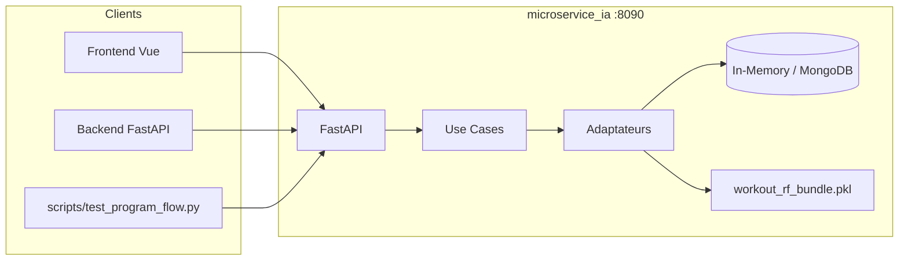

**Hors périmètre actuel** : authentification JWT (aucun middleware auth), intégration Docker Compose globale, ré-entraînement automatique depuis MongoDB.

---

## 2. Arborescence du projet

```text
microservice_ia/
├── app/
│   ├── main.py                          # Point d'entrée FastAPI
│   ├── domain/
│   │   ├── entities/                    # UserProfile, WorkoutProgram, …
│   │   ├── ports/                       # Interfaces abstraites
│   │   └── services/                    # session_progression.py
│   ├── application/
│   │   └── use_cases/                   # 8 cas d'usage
│   ├── infrastructure/
│   │   ├── adapters/                    # Mifflin, rule-based, ML, composite
│   │   ├── repositories/                # In-memory + MongoDB
│   │   └── persistence/mongodb/         # Client, mappers BSON
│   └── presentation/
│       ├── api/routes/                  # v1_routes, recommendation_routes
│       ├── api/schemas/                 # Pydantic v1
│       ├── api/mappers/                 # Domaine → JSON réponse
│       └── dependencies.py              # AppContainer (composition root)
├── ml/
│   ├── generate_training_data.py        # Dataset synthétique 1500 lignes
│   └── train_random_forest.py           # Entraînement → .pkl
├── models/
│   └── workout_rf_bundle.pkl            # Modèle servi en inférence
├── scripts/
│   └── test_program_flow.py             # Test manuel + rapport JSON
├── tests/                               # 17 tests pytest
├── docs/
│   ├── DOCUMENTATION_TECHNIQUE.md       # Ce document
│   └── mongodb_schema.md                # Schéma des 3 collections
└── requirements.txt
```

---

## 3. Clean Architecture

Le code respecte une **dépendance unidirectionnelle** : les couches externes implémentent les contrats définis par le domaine, jamais l'inverse.

```mermaid
flowchart TB
    subgraph presentation [Presentation]
        R[Routes FastAPI]
        S[Schémas Pydantic]
        D[dependencies.py]
    end

    subgraph application [Application]
        UC1[GenerateProgramUseCase]
        UC2[AdjustSessionUseCase]
        UC3[RecordSessionFeedbackUseCase]
        UC4[RecommendCaloriesUseCase]
        UC5[RecommendExercisesUseCase]
        UC6[GetCurrentProgramUseCase]
        UC7[GetProfileHistoryUseCase]
        UC8[UpdateProfileConstraintsUseCase]
    end

    subgraph domain [Domain]
        E[Entités]
        P[Ports ABC]
        DS[Services métier]
    end

    subgraph infrastructure [Infrastructure]
        A1[MifflinCalorieRecommender]
        A2[RuleBasedExerciseRecommender]
        A3[RandomForestExerciseRecommender]
        A4[CompositeProgramGenerator]
        R1[InMemoryProgramRepository]
        R2[MongoProgramRepository]
    end

    R --> D --> UC1 & UC2 & UC3 & UC4 & UC5 & UC6 & UC7 & UC8
    UC1 & UC2 & UC3 & UC4 & UC5 & UC6 & UC7 & UC8 --> P
    UC1 & UC2 & UC3 & UC4 & UC5 & UC6 & UC7 & UC8 --> E
    UC1 & UC2 --> DS
    A1 & A2 & A3 & A4 -. implémente .-> P
    R1 & R2 -. implémente .-> P
    D --> A1 & A2 & A3 & A4 & R1 & R2
```

### Couches — responsabilités

| Couche | Fichiers clés | Règle |
|--------|---------------|-------|
| **Domain** | `entities/`, `ports/`, `services/` | Aucune import FastAPI, pymongo, sklearn |
| **Application** | `use_cases/` | Orchestre ports ; pas de HTTP |
| **Infrastructure** | `adapters/`, `repositories/` | Implémente les ports |
| **Presentation** | `routes/`, `schemas/`, `dependencies.py` | HTTP, validation, DI |

---

## 4. Composition root et injection de dépendances

`app/presentation/dependencies.py` construit un **`AppContainer`** singleton lazy :

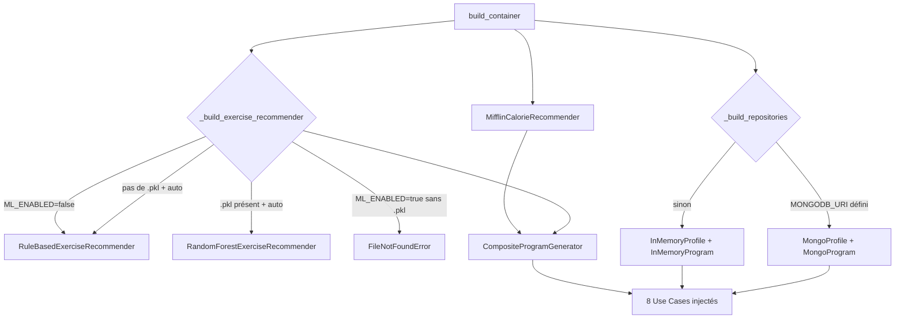

### AppContainer — contenu

| Propriété | Type | Rôle |
|-----------|------|------|
| `recommend_calories` | `RecommendCaloriesUseCase` | Route legacy calorique |
| `recommend_exercises` | `RecommendExercisesUseCase` | Route legacy exercices |
| `generate_program` | `GenerateProgramUseCase` | POST `/api/v1/recommendations/generate` |
| `get_current_program` | `GetCurrentProgramUseCase` | GET `.../current` |
| `adjust_session` | `AdjustSessionUseCase` | POST `.../adjust` |
| `record_session_feedback` | `RecordSessionFeedbackUseCase` | POST `.../feedback` |
| `update_profile_constraints` | `UpdateProfileConstraintsUseCase` | PUT `.../constraints` |
| `get_profile_history` | `GetProfileHistoryUseCase` | GET `.../history` |
| `profiles` | `ProfileRepositoryPort` | Accès profils / contraintes |
| `programs` | `ProgramRepositoryPort` | Programmes + feedback |
| `exercise_recommender` | `ExerciseRecommenderPort` | Instance active (ML ou rule-based) |

`reset_container()` remet le singleton à `None` — utilisé par les tests ML pour recharger le modèle.

---

## 5. Modèle de domaine

### 5.1 Entités principales

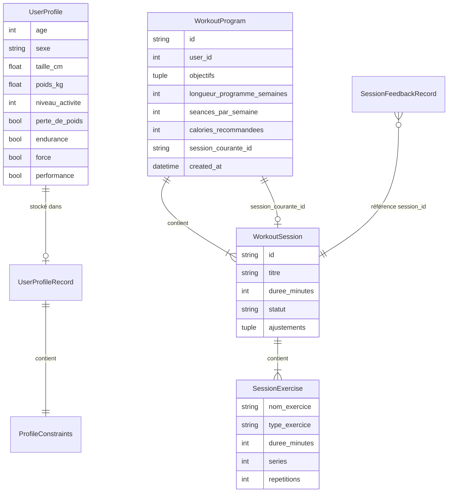

### 5.2 Statuts de séance

| Statut | Signification |
|--------|---------------|
| `planifiee` | Séance générée, pas encore modifiée |
| `ajustee` | Séance modifiée via POST `/adjust` |
| `terminee` | Feedback enregistré via POST `/feedback` |

### 5.3 Ports (interfaces)

| Port | Méthodes | Implémentations |
|------|----------|-----------------|
| `CalorieRecommenderPort` | `recommend(profile)` | `MifflinCalorieRecommender` |
| `ExerciseRecommenderPort` | `recommend(profile, limit, context?)` | `RuleBased…`, `RandomForest…` |
| `ProgramGeneratorPort` | `generate(input)`, `adjust(program, input)` | `CompositeProgramGenerator` |
| `ProgramRepositoryPort` | CRUD programme, feedback, list_feedback | InMemory, Mongo |
| `ProfileRepositoryPort` | get, upsert, update_constraints | InMemory, Mongo |

### 5.4 Service domaine — progression

`app/domain/services/session_progression.py` :

| Fonction | Rôle |
|----------|------|
| `next_pending_session_id(sessions)` | Première séance non `terminee` |
| `resolve_current_session_id(program)` | Corrige le pointeur si séance courante déjà faite |
| `apply_session_completion(program, session_id)` | Marque `terminee` + avance pointeur |
| `count_completed_sessions(program)` | Compte les séances terminées |
| `compute_performance_history_score(feedback)` | Score pour le ML (défaut 10.0) |

---

## 6. API HTTP — routes et contrats

### 6.1 Vue d'ensemble

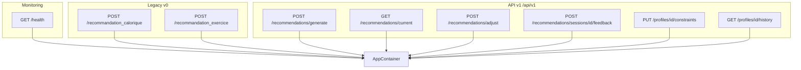

### 6.2 API v1 — détail

#### POST `/api/v1/recommendations/generate`

Génère un programme complet.

**Corps JSON** :

| Champ | Type | Contraintes |
|-------|------|-------------|
| `user_id` | int | > 0 |
| `objectifs` | string[] | min 1 élément |
| `niveau` | int | 1–5 |
| `equipements` | string[] | |
| `limitations` | string[] | blessures |
| `disponibilite_minutes` | int | 15–180 |
| `seances_par_semaine` | int | 1–7 |
| `longueur_programme_semaines` | int | 1–52 |
| `profil` | object? | age, sexe H/F, taille_cm, poids_kg |

**Nombre de séances produites** :

```text
total = longueur_programme_semaines × seances_par_semaine
```

Titres : `Semaine {N} — Séance {M}`.

#### GET `/api/v1/recommendations/current?user_id=`

Retourne le programme `active` de l'utilisateur. Synchronise `session_courante_id` si nécessaire. **404** si aucun programme.

#### POST `/api/v1/recommendations/adjust`

Ajuste **uniquement** la séance pointée par `session_courante_id`.

| Champ | Type | Effet |
|-------|------|-------|
| `user_id` | int | Identifie le programme actif |
| `fatigue` | int 1–10 | ≥ 7 → réduit durée × 0.7, retire 1 exercice |
| `douleur` | bool | Filtre vers cardio/souplesse |
| `temps_partiel_minutes` | int? | Plafonne la durée |

#### POST `/api/v1/recommendations/sessions/{session_id}/feedback`

| Champ | Type |
|-------|------|
| `user_id` | int |
| `rpe` | int 1–10 |
| `exercices_valides` | string[] |
| `ressentis` | string |

Effets : séance → `terminee`, pointeur → séance suivante, log historique.

#### PUT `/api/v1/profiles/{profile_id}/constraints`

```json
{ "equipements_dispo": [], "blessures_actives": [] }
```

#### GET `/api/v1/profiles/{profile_id}/history`

Query optionnelles : `date_from`, `date_to`.

Réponse enrichie :

```json
{
  "user_id": 42,
  "seances_terminees": 4,
  "session_courante_id": "uuid-seance-5",
  "performance_history_score": 11.4,
  "sessions_feedback": [...]
}
```

### 6.3 Legacy v0

| Route | Use case | Adaptateur |
|-------|----------|------------|
| `POST /recommandation_calorique` | `RecommendCaloriesUseCase` | Mifflin |
| `POST /recommandation_exercice` | `RecommendExercisesUseCase` | ML ou rule-based |

---

## 7. Flux métier détaillés

### 7.1 Génération de programme

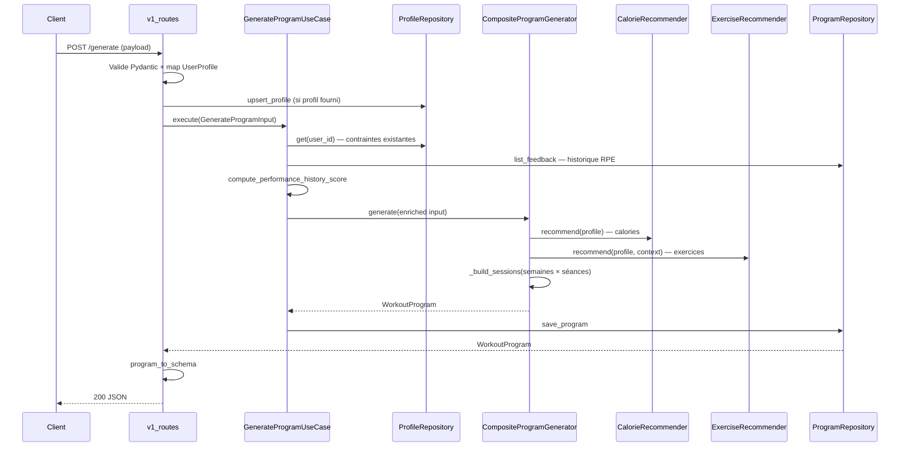

**Étapes internes `_build_sessions`** :

1. Pour chaque semaine `1..longueur_programme_semaines`
2. Pour chaque séance `1..seances_par_semaine`
3. Copie les exercices recommandés (filtrage limitations équipement)
4. Attribue séries ML ou 3 par défaut pour musculation
5. Première séance → `session_courante_id`

### 7.2 Cycle de vie d'un programme

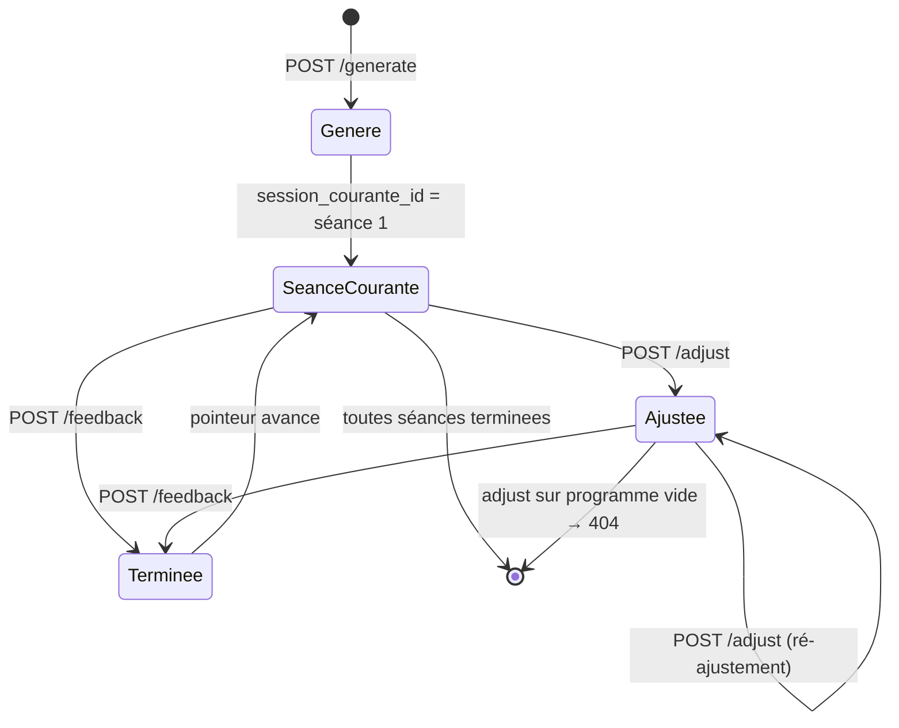

### 7.3 Progression après séances 1–4

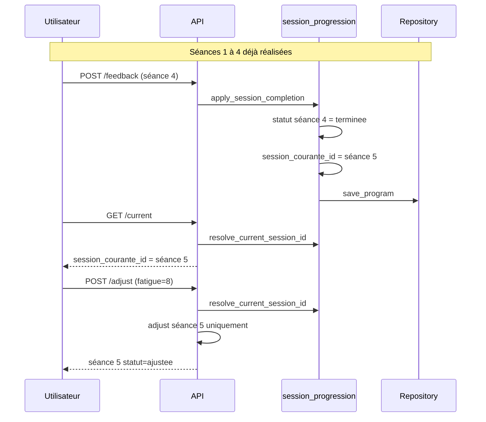

### 7.4 Logique d'ajustement (`CompositeProgramGenerator.adjust`)

Appliquée **uniquement** à la session dont `id == session_courante_id` :

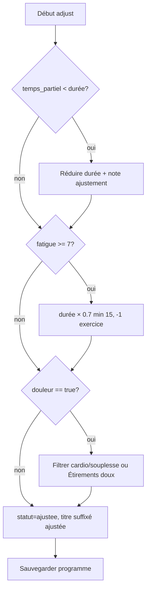

Les séances passées (`terminee`) ne sont **jamais** modifiées.

---

## 8. Moteur calorique (Mifflin-St Jeor)

**Fichier** : `app/infrastructure/adapters/mifflin_calorie_adapter.py`

Aligné sur `Frontend/src/services/calorieCalculator.ts`.

### Formule

```text
BMR = 10 × poids_kg + 6.25 × taille_cm − 5 × age + ajustement_sexe
```

| Sexe | Ajustement |
|------|------------|
| H | +5 |
| F | −161 |
| autre | −78 |

```text
maintenance = BMR × facteur_activité[niveau]
```

| Niveau | Facteur |
|--------|---------|
| 1 | 1.2 |
| 2 | 1.375 |
| 3 | 1.55 |
| 4 | 1.725 |
| 5 | 1.9 |

**Ajustement objectif** :

| Objectif | Delta kcal |
|----------|------------|
| perte_de_poids | −400 |
| performance ou force | +250 |
| endurance | +150 |
| sinon | 0 |

**Arrondi** : multiple de 50, minimum 1200 (F) / 1500 (autre).

### Exemple testé

Profil : H, 30 ans, 180 cm, 75 kg, niveau 3, sans objectif → **2700 kcal**, BMR **1730**.  
Avec `perte_de_poids` → **2300 kcal**.

---

## 9. Recommandation d'exercices

### 9.1 Mode rule-based (fallback)

**Fichier** : `rule_based_exercise_adapter.py`

- Catalogue de 10 exercices avec tags (`cardio`, `force`, `perte`, …)
- Scoring par intersection tags / objectifs profil
- Filtrage niveau difficulté selon `niveau_activite`

### 9.2 Mode Random Forest (prioritaire si `.pkl` présent)

**Fichier** : `ml_random_forest_adapter.py`

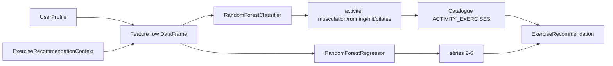

**Contexte ML** (`ExerciseRecommendationContext`) :

| Champ | Source generate |
|-------|-----------------|
| `current_fatigue_rpe` | défaut 5 |
| `desired_duration_min` | `disponibilite_minutes` |
| `performance_history_score` | historique feedback |
| `equipment_available` | `equipements` |
| `physical_limitation` | `limitations[0]` |
| `preferred_activity` | dérivé des objectifs |

---

## 10. Pipeline Machine Learning

### 10.1 Vue d'ensemble

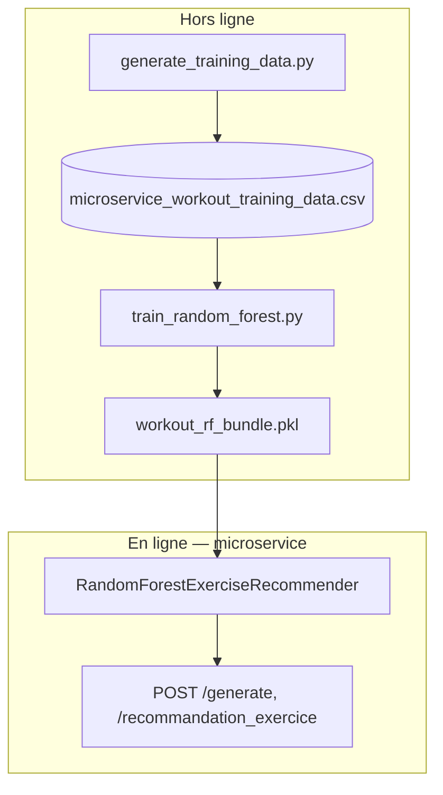

### 10.2 Génération des données synthétiques

**Script** : `python -m ml.generate_training_data`

| Paramètre | Valeur |
|-----------|--------|
| `N_USERS` | 100 |
| `SESSIONS_PER_USER` | 15 |
| **Total lignes** | 1500 |

**Features** : age, height_cm, weight_kg, fitness_level, health_goal, equipment, preferred_activity, physical_limitation, current_fatigue_rpe, desired_duration_min, performance_history_score, session_timestamp.

**Labels** (règles métier simulées) :

- `recommended_activity` — classification (blessure genou → pilates/musculation, perte_graisse → hiit/running, …)
- `recommended_sets` — régression (base niveau + progression session − fatigue)

**Sortie** : `ml/data/microservice_workout_training_data.csv`

### 10.3 Entraînement

**Script** : `python -m ml.train_random_forest`

| Modèle | Algorithme | Cible |
|--------|------------|-------|
| `classifier` | RandomForestClassifier (120 arbres, depth 12) | `recommended_activity` |
| `regressor` | RandomForestRegressor (120 arbres, depth 10) | `recommended_sets` |

**Préprocessing** : `LabelEncoder` sur 5 features catégorielles + cible activité.

**Split** : 80 % train / 20 % test, `random_state=42`.

**Métriques typiques** :

| Métrique | Valeur observée |
|----------|---------------|
| accuracy_activity | ~0.91 |
| mae_sets | ~0.03 |

**Bundle exporté** (`joblib`) :

```python
{
    "version": "1.0",
    "classifier": RandomForestClassifier,
    "regressor": RandomForestRegressor,
    "encoders": { feature: LabelEncoder, ... },
    "feature_columns": [...],
    "metrics": { "accuracy_activity", "mae_sets", ... }
}
```

### 10.4 Sélection moteur à runtime

| `ML_ENABLED` | `.pkl` présent | Moteur |
|--------------|----------------|--------|
| `auto` | oui | Random Forest |
| `auto` | non | rule-based |
| `true` | oui | Random Forest |
| `true` | non | **erreur au démarrage** |
| `false` | * | rule-based |

`GET /health` → `"ml_engine": "loaded"` ou `"rule_based"`.

---

## 11. Persistance MongoDB

Activée si `MONGODB_URI` est défini. Sinon : **dépôts in-memory** (perdus au redémarrage).

Documentation collections : [`mongodb_schema.md`](mongodb_schema.md).

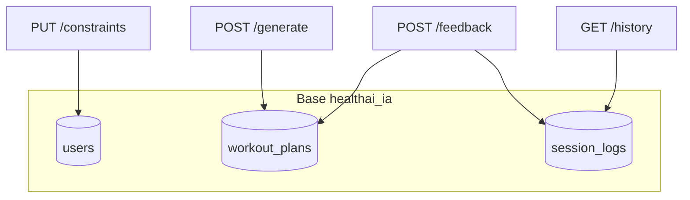

| Collection | Opérations |
|------------|------------|
| `users` | upsert profil, update constraints ; index unique `user_ref` |
| `workout_plans` | save_program ; 1 seul `status=active` par user |
| `session_logs` | insert à chaque feedback ; metrics completion_rate, RPE |

**Mapping** : `app/infrastructure/persistence/mongodb/mappers.py`  
**Repositories** : `mongo_repositories.py`

---

## 12. Progression des séances et historique

### Score de performance

```text
score = 10.0 + (nb_feedbacks × 0.3) − (moyenne_RPE × 0.2) + (moyenne_exercices_validés × 0.1)
score = max(5.0, score)
```

Utilisé lors d'un **nouveau** `POST /generate` pour enrichir le contexte ML.

### Ce qui n'est PAS recalculé automatiquement

- Les exercices des séances 5–12 **déjà générées** ne changent pas quand les séances 1–4 sont terminées
- `adjust` ne relance pas le modèle ML : il modifie in-place la séance courante
- Un nouveau programme complet nécessite un nouvel appel `POST /generate`

---

## 13. Tests automatisés (pytest)

**Lancement** :

```bash
cd microservice_ia
pip install -r requirements.txt
pytest -v
```

**17 tests** répartis en 4 fichiers.

### 13.1 Cartographie des tests

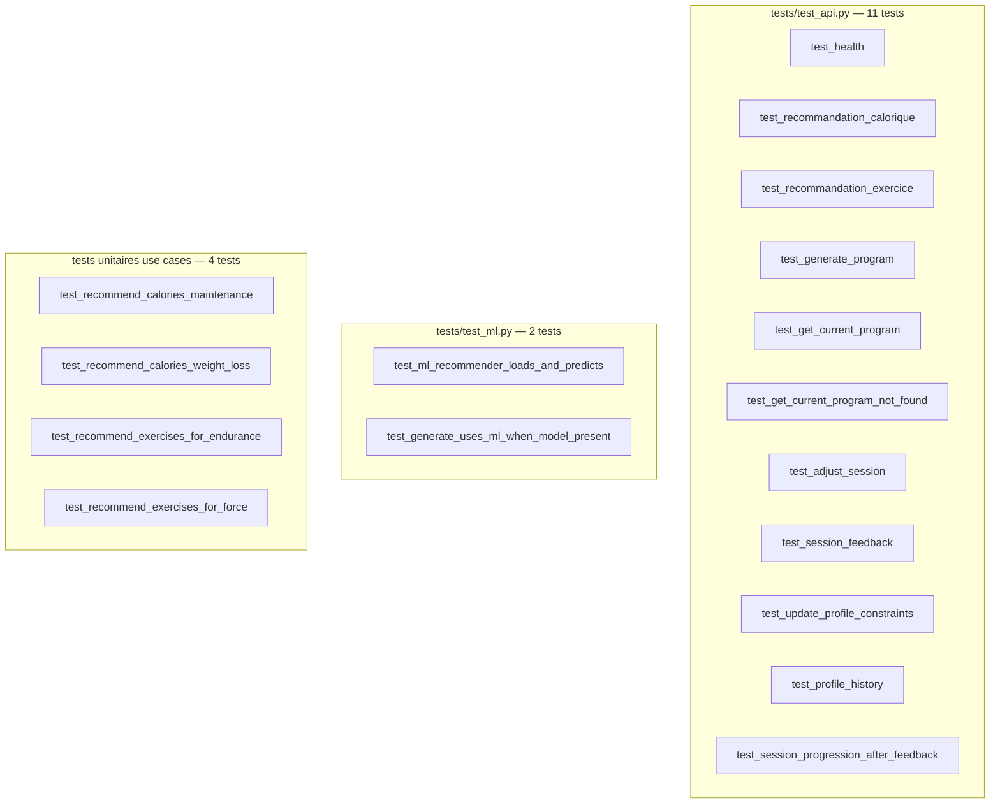

### 13.2 Détail par test

#### `tests/test_api.py` — tests d'intégration HTTP

| Test | Route(s) | Assertions clés |
|------|----------|-----------------|
| `test_health` | GET `/health` | status 200, service=microservice_ia |
| `test_recommandation_calorique` | POST legacy | calories=2700, BMR=1730 |
| `test_recommandation_exercice` | POST legacy | ≤3 exercices, score>0 |
| `test_generate_program` | POST `/generate` | 12 séances, 4 sem × 3, calories=2300, titre Semaine 1 |
| `test_get_current_program` | generate + GET current | user_id=42 |
| `test_get_current_program_not_found` | GET user 9999 | 404 |
| `test_adjust_session` | generate + adjust | statut=ajustee, durée≤45 |
| `test_session_feedback` | generate + feedback | rpe=7 en réponse |
| `test_update_profile_constraints` | PUT constraints | haltères, genou présents |
| `test_profile_history` | generate + feedback + history | ≥1 feedback |
| `test_session_progression_after_feedback` | 4× feedback + adjust | pointeur=séance 5, 4 terminees, adjust séance 5 |

#### `tests/test_ml.py` — tests machine learning

| Test | Scope | Comportement |
|------|-------|--------------|
| `test_ml_recommender_loads_and_predicts` | Adaptateur seul | Charge `.pkl`, prédit activité+séries, accuracy>0.5 |
| `test_generate_uses_ml_when_model_present` | E2E API | `reset_container()`, POST generate, exercices présents |

**Fixture** `ensure_model` : entraîne automatiquement si `.pkl` absent.

#### `tests/test_calorie_use_case.py`

Tests unitaires directs sur `RecommendCaloriesUseCase` + `MifflinCalorieRecommender` (sans HTTP).

#### `tests/test_exercise_use_case.py`

Tests rule-based : profil endurance → exercices cardio ; profil force → musculation.

### 13.3 Isolation et état partagé

- **In-memory** par défaut en tests (pas de MongoDB)
- **AppContainer singleton** : les tests API partagent l'état user_id=42
- **ML** : `reset_container()` avant test generate ML pour forcer rechargement adaptateur
- **Ordre** : pytest exécute les tests ; l'état user 42 peut persister entre tests API (acceptable car IDs séances uniques par generate)

---

## 14. Test manuel de génération (`scripts/`)

### 14.1 Script `test_program_flow.py`

Test **bout-en-bout** contre un serveur live (port 8090).

```bash
# Terminal 1
uvicorn app.main:app --reload --port 8090

# Terminal 2
cd microservice_ia
python scripts/test_program_flow.py
```

**Variables** :

| Variable | Défaut |
|----------|--------|
| `MICROSERVICE_URL` | http://localhost:8090 |
| `TEST_USER_ID` | 42 |
| `TEST_OUTPUT_FILE` | scripts/test_program_flow_result_YYYYMMDD_HHMMSS.json |

### 14.2 Flux du script

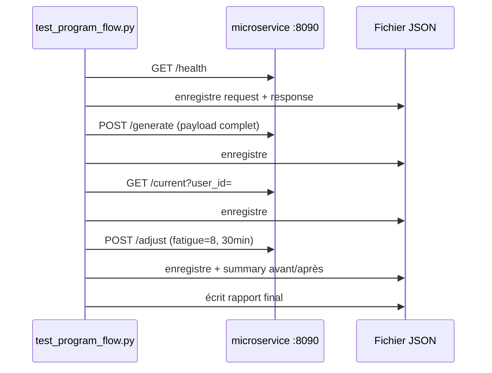

### 14.3 Structure du rapport JSON

```json
{
  "meta": {
    "base_url": "http://localhost:8090",
    "user_id": 42,
    "executed_at": "2026-06-19T12:54:53+00:00",
    "output_file": "scripts/test_program_flow_result_....json"
  },
  "steps": [
    {
      "name": "Génération du programme",
      "request": {
        "method": "POST",
        "url": "http://localhost:8090/api/v1/recommendations/generate",
        "path": "/api/v1/recommendations/generate",
        "query": {},
        "body": { "... payload complet ..." }
      },
      "response": {
        "status_code": 200,
        "body": { "... programme 12 séances ..." }
      }
    }
  ],
  "summary": {
    "success": true,
    "adjustment_comparison": {
      "session_id": "...",
      "avant": { "duree_minutes": 45, "statut": "planifiee" },
      "apres": { "duree_minutes": 30, "statut": "ajustee", "ajustements": [...] }
    }
  }
}
```

Les fichiers `test_program_flow_result*.json` sont **gitignored**.

### 14.4 Extension manuelle — tester la progression

Pour simuler séances 1–4 terminées, enchaîner après le script :

```bash
# Récupérer les session_id depuis le JSON généré, puis :
for ID in session_1 session_2 session_3 session_4; do
  curl -X POST "http://localhost:8090/api/v1/recommendations/sessions/$ID/feedback" \
    -H "Content-Type: application/json" \
    -d '{"user_id":42,"rpe":6,"exercices_valides":["Marche rapide"],"ressentis":"OK"}'
done

curl "http://localhost:8090/api/v1/recommendations/current?user_id=42"
curl -X POST http://localhost:8090/api/v1/recommendations/adjust \
  -H "Content-Type: application/json" \
  -d '{"user_id":42,"fatigue":7,"douleur":false,"temps_partiel_minutes":35}'
```

---

## 15. Variables d'environnement

| Variable | Défaut | Description |
|----------|--------|-------------|
| `API_ROOT_PATH` | *(vide)* | Préfixe reverse proxy |
| `MONGODB_URI` | *(vide)* | Active MongoDB si défini |
| `MONGODB_DB` | `healthai_ia` | Nom de la base |
| `ML_MODEL_PATH` | `models/workout_rf_bundle.pkl` | Chemin modèle |
| `ML_ENABLED` | `auto` | `auto` / `true` / `false` |
| `MICROSERVICE_URL` | — | Script test manuel uniquement |
| `TEST_USER_ID` | `42` | Script test manuel |
| `TEST_OUTPUT_FILE` | auto timestamp | Rapport JSON script |

---

## 16. Annexes — statuts et formules

### A. Matrice décisionnelle — quel use case pour quelle route ?

| Route HTTP | Use Case | Repository | Adaptateur(s) |
|------------|----------|------------|---------------|
| POST `/generate` | GenerateProgramUseCase | Program, Profile | Composite, Mifflin, ML/RB |
| GET `/current` | GetCurrentProgramUseCase | Program | session_progression |
| POST `/adjust` | AdjustSessionUseCase | Program | Composite.adjust |
| POST `/feedback` | RecordSessionFeedbackUseCase | Program | session_progression |
| PUT `/constraints` | UpdateProfileConstraintsUseCase | Profile | — |
| GET `/history` | GetProfileHistoryUseCase | Program, Profile | session_progression |
| POST `/recommandation_calorique` | RecommendCaloriesUseCase | — | Mifflin |
| POST `/recommandation_exercice` | RecommendExercisesUseCase | — | ML/RB |

### B. Diagramme de déploiement cible

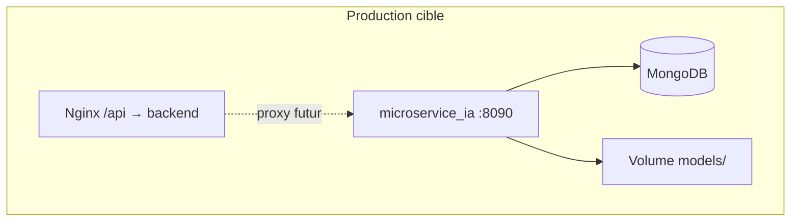

### C. Checklist développeur

```bash
# 1. Environnement
cd microservice_ia && python -m venv .venv && source .venv/bin/activate
pip install -r requirements.txt

# 2. ML (optionnel mais recommandé)
python -m ml.generate_training_data
python -m ml.train_random_forest

# 3. Tests automatisés
pytest -v

# 4. Serveur local
uvicorn app.main:app --reload --port 8090

# 5. Test manuel + rapport JSON
python scripts/test_program_flow.py

# 6. Swagger
open http://localhost:8090/docs
```

### D. Liens internes

- [README opérationnel](../README.md)
- [Schéma MongoDB](mongodb_schema.md)
- [Backend principal — calcul calories](../../Frontend/src/services/calorieCalculator.ts)

---

*Document généré pour le dépôt HealthAI MSPR — microservice_ia.*
